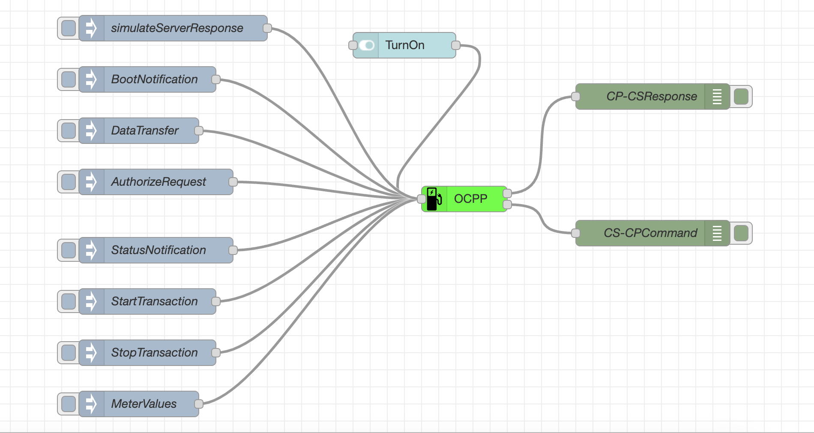
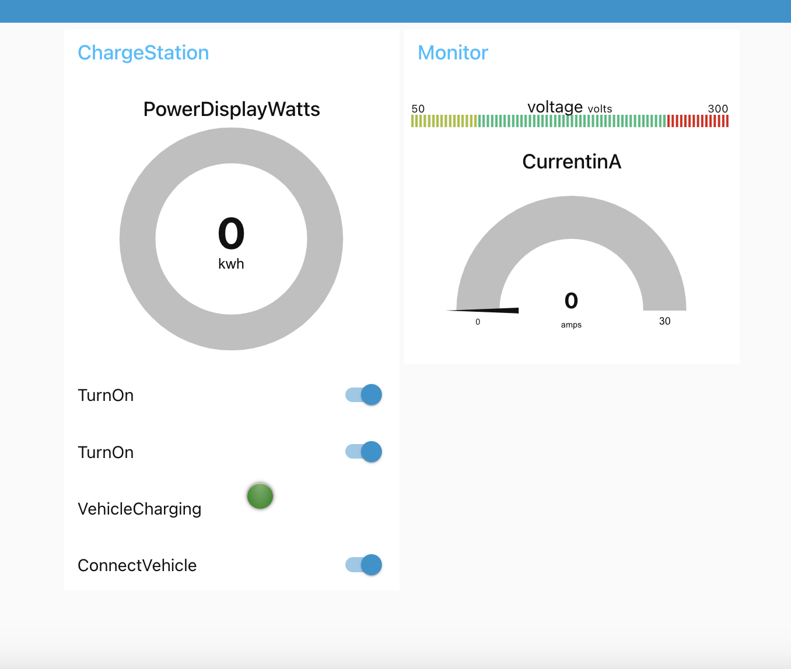

# OCPP 1.6 client
This library provides node red OCPP 1.6 client which can connect to any OCPP 1.6 server and it supports security profile 1. It can be extended to support security profile 2 and 3.

### Pre-Reqsites
This library would require nodejs version 16 and above.

### Dependencies
There are no dependencies if you are just using the OCPP client to work with server. If you wish to build a Charging Station Simulator like in the example. You need following node-red dependencies
- node-red-contrib-power-monitor
- node-red-contrib-ui-actions
- node-red-contrib-ui-level
- node-red-dashboard

### How to use it

Install using
```
cd ~/.node-red     

npm install @karthik1984/node-red-contrib-ocpp-client

```

The OCPP node has 1 input and 2 outputs.

- Input node is used send OCPP1.6 commands to the OCPP server and receive the response in first output
- output node 2 will provide the data for command from OCPP server to OCPP client (CS-CP)

### Examples
Examples are in the examples folder of this repo


#### Example 1
A basic example flow to manually trigger commands to the OCPP server via OCPP client function node



#### Example 2
It contains how to build a Charge Station simulator using this OCPP client function node

